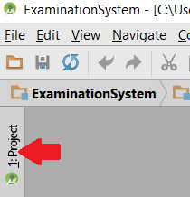
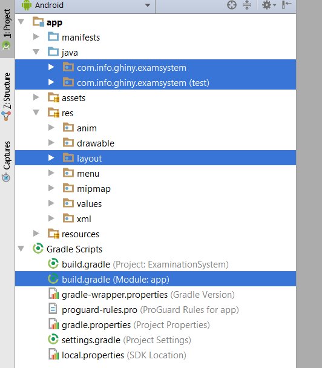
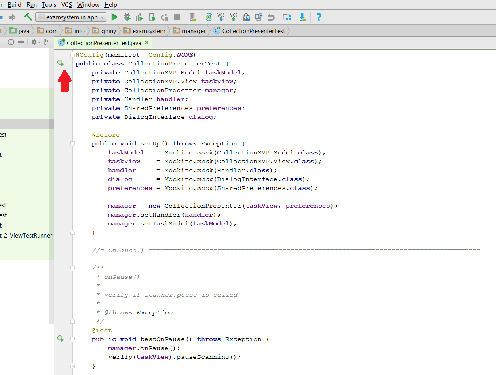
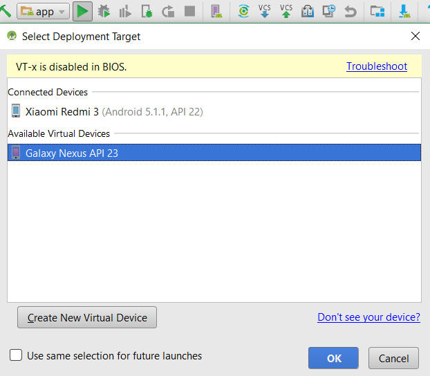

# ExaminationSystem
Description
===============
An Android based Exam Attendance System that utilize QR code for data interaction.
Scan QR code to take attendance of candidate & staff.
Using ZXing QR scan library to decode QR code and query database through socket network.


Software Requirements
========
- **Java**
  - *Download Java JDK at http://www.oracle.com/technetwork/java/javase/downloads/jdk8-downloads-2133151.html*
  - *Install Java*
  - *Set Environment Variable for JAVA_HOME to the path where the JDK was downloaded.*
  - Example:
    ````
    C:\Program Files\Java\jdk1.8.0_111
    ````
- **Git**
  - *Download Git at https://git-scm.com/downloads*
  - *Install Git Bash*
- **Gradle**
  - *Download Gradle's Complete Distribution at https://gradle.org/gradle-download/*
  - *Set Environment Variable for GRADLE_HOME to the path where Gradle was saved.*
  - Example:
    ````
    C:\gradle-3.1-all\gradle-3.1
    ````
- **Android Studio**
  - *Download Android Studio at https://developer.android.com/studio/index.html*
  - *Install Android Studio*
- **SQLiteBrowser**
  - *Download SQLiteBrowser at http://sqlitebrowser.org/*
  - *Install SQLite Browser*
- **NetBean**
  - *Download NetBean IDE at https://netbeans.org/downloads/*
  - *Install NetBean*


Project Development:
==================
Clone Project into Computer
------
Open GitBash (like cmd) and type: 
````
git clone https://github.com/EmeraldWolfram/ExaminationSystem
````
to clone the project into the computer.
Development
-----
- Open Android Studio -> Open an existing Android Studio project -> browse the project cloned (ExaminationSystem)

- Wait for project initialization. *(Slow if the computer have small RAM)*
- Project can be developed in all the folder in this list

- Important Starting Point were highlighted in blue
  - 1st highlighted folder store JAVA program
  - 2nd highlighted folder store TEST code
  - 3rd highlighted folder store USER INTERFACE layout
  - 4th highlighted folder allow dependency and library inclusion


Testing
-----
- To run automated Test, press the circular green button as shown below:

- To run on PC Simulator, select 'app' and press 'RUN' on the targeted virtual device as shown below:

- To run on a real Android Phone
  - Flash through USB cable
    - Enable Developer Mode in Android phone by pressing Build Number under Setting for 7 times.
    - In Android Studio, select 'app' & press 'RUN' on the connected Phone via USB cable
    **NOTE that you could brick your phone if you disconnect your phone while flashing**
  - Generate APK and install
    - Generate APK as shown below
    [APK Generation](screenshot/BuildingAPK.png)
    - The APK will be generated in app/build/outputs/apk/app-debug.apk
    - Suggestion: Upload to Google Drive, download and install
    - If you FAIL to install the APK, uninstall the existing application and retry.
    
Presentation
-----
Vysor, a good Google Chrome application for Android project presentation.
- Install Google Chrome and search for Vysor
- Install Vysor as a extension for Google Chrome

QR Generator
-----------
Generate QR code at https://www.the-qrcode-generator.com/
- This website is user-friendly compared to others website
- It is FOC

QR code can also be generated in the application using method encodeQr() in DistributionModel.java

Copyright
----------
Copyright (C) 2016 - 2017 Steven Foong Ghin Yew <stevenfgy@yahoo.com>

Licensed under the Apache License, Version 2.0 (the "License"); 
you may not use this file except in compliance with the License.
You may obtain a copy of the License at

http://www.apache.org/licenses/LICENSE-2.0

Unless required by applicable law or agreed to in writing, 
software distributed under the License is distributed on an "AS IS" BASIS, 
WITHOUT WARRANTIES OR CONDITIONS OF ANY KIND, either express or implied. 
See the License for the specific language governing permissions and 
limitations under the License.
